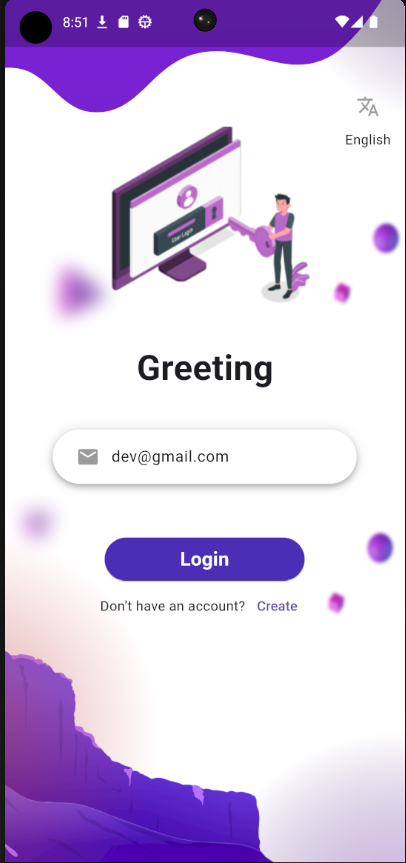
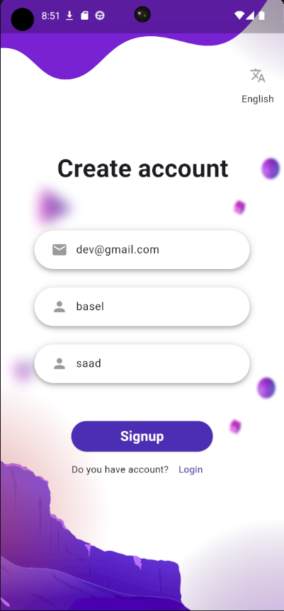
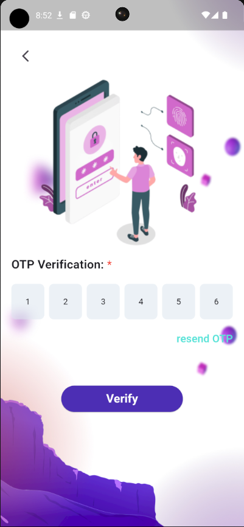
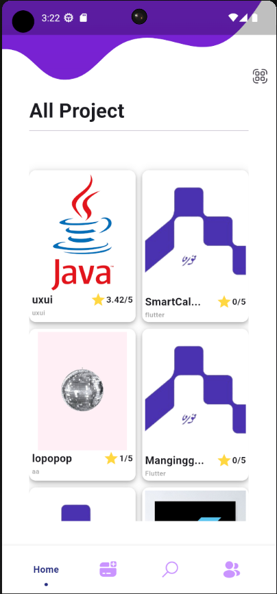
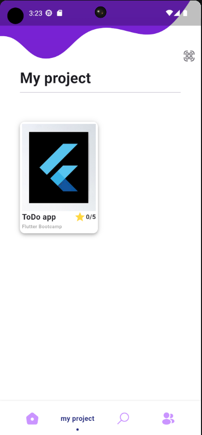
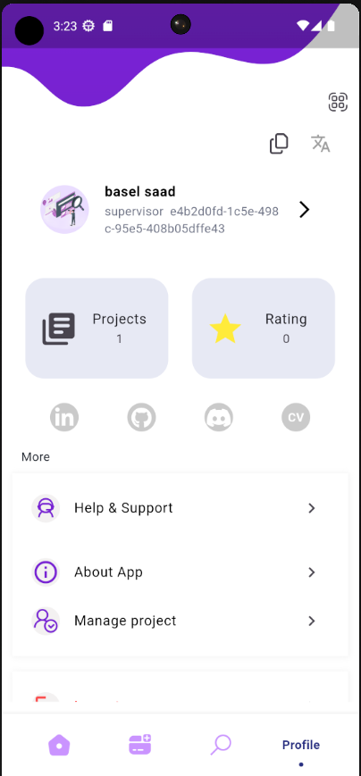
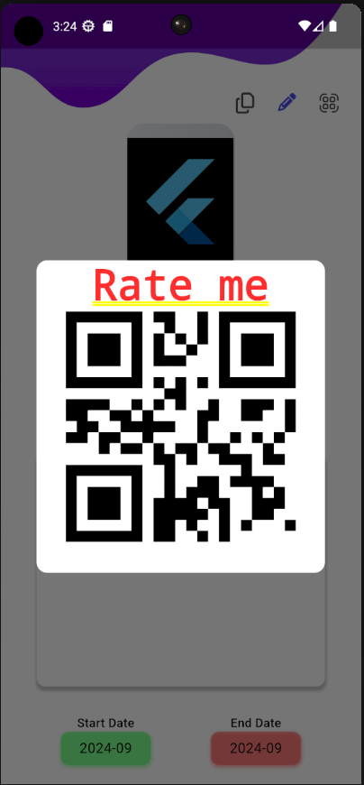

# Tuwaiq BootCamps Projects App


## Overview

### Purpose
The purpose of this app is to allow Supervisors to manage their projects. Supervisors can promote users to Team Lead to manage project details and assign tasks to members who participate.

### Features
- **API Integration**: The project connects to an API for data storage on the server.

- **Elegant Design**: The design is clean and modern, balancing beauty and simplicity.

- **Auth Function**: The app provides login & sign-up OTP From API functions.

- **Local Storage**: The app stores and updates the items locally.

- **Rating Functionality**: Users can rate projects by scanning a QR code.

### **SuperVisor**:
- **Create Project**: The SuperVisor can create a Project and link it with `user_id` as a Team Lead.
  
- **Update Project**: The SuperVisor can update the main info about Project like `allow_edit`-`is_public`-`time_end_edit`-`allow_rating`
  
- **Delete Project**: The SuperVisor can remove Project.

- **Read Project**: The SuperVisor can View and edit Project.

### **User**:

- **Create Project**: The TeamLead can only create a Project and fill all the requirements about project as a Team Lead and  can links it with other Members.
  
- **Update Project**: The TeamLead can only update all his Project.

- **Edit Logo, Base, and more**: Team Leads can edit the project’s logo, base, and more.


## Widgets & External Packages

### Main Widgets
- **TextField**: The `TextField` widget is used to allow users to input text.

- **SnackBar**: The `SnackBar` is used to show error messages to the users.

- **BottomNavigationBar**: The `BottomNavigationBar` is used to navigate between different sections of the app, such as the Home, Add Items screen, and Profile.

- **Builder**: The `Builder` widget is used to create a new context for the child widget.

### External Packages
- **get_it**: A simple Service Locator for Dart and Flutter projects.

- **get_storage**: A fast, extra light, and synchronous key-value in memory, which backs up data to disk at each operation. It is written entirely in Dart and easily integrates with the Get framework of Flutter.

- **dio**: HTTP networking package for Dart/Flutter, supports Global configuration, Interceptors, FormData, Request cancellation, File uploading/downloading,etc.

- **pinput**: provides an easy-to-use and customizable Pin code input field. It offers several features such as animated decoration switching, form validation, SMS autofill.

- **flashy_tab_bar2**: A flashy and animated tab bar for navigation.

- **Icons Plus**: A package for Flutter developers that provides a collection of attractive icons from different packs.

- **Font Awesome Flutter**: A package to use Font Awesome icons in Flutter apps.

- **image_picker**: A tool for picking images from the gallery or camera.

- **url_launcher**: A Flutter plugin for launching a URL.

- **network_to_file_assets/readme/image**: Downloads assets/readme/images from the internet and stores them as files for future use.

- **file_picker**: Helps in picking files from the user's device.

- **smooth_page_indicator**:Customizable animated page indicator with a set of built-in effects.

- **carousel_slider**:A carousel slider widget, support infinite scroll and custom child widget.

- **flutter_rating_bar**:A simple yet fully customizable ratingbar for flutter which also include a rating bar indicator, supporting any fraction of rating.

- **cached_network**:Flutter library to load and cache network images. Can also be used with placeholder and error widgets.

- **qr_flutter**:QR.Flutter is a Flutter library for simple and fast QR code rendering via a Widget or custom painter.

- **barcode_scan2**:A flutter plugin for scanning 2D barcodes and QRCodes via camera.

- **flutter_bloc**: A predictable state management library that helps implement the BLoC (Business Logic Component) design pattern

- **cupertino_icons**: Flutter widgets implementing the current iOS design language.


## Instructions for Running the App

### Prerequisites
- Flutter SDK

### Running the App
1. Clone the repository: 
   ```bash
   git clone https://github.com/Basel-75/Project-7.git
2. Navigate to the project directory: 
   ```bash
   cd Project-7

3. Install dependencies: 
   ```bash
   flutter pub get

4. Run the app on an emulator or connected device: 
   ```bash
   flutter run


## Output

### Screenshot













### Demo Video


## Team

- [Basel](https://github.com/Basel-75)
- [Anas Aljuhani](https://github.com/Anas-Aljuhani)
- [Ammar](https://github.com/Ammarx9)

## Additional Features

### Team Lead Capabilities

- **Edit Logo, Base, and more**: Team Leads can now edit the project’s logo, base, and more.

#### Rating Features:

- **QR Code Scanner**: Users can rate projects by scanning a QR code.

- **QR Code Generator**: Generate QR codes for projects to facilitate rating.
